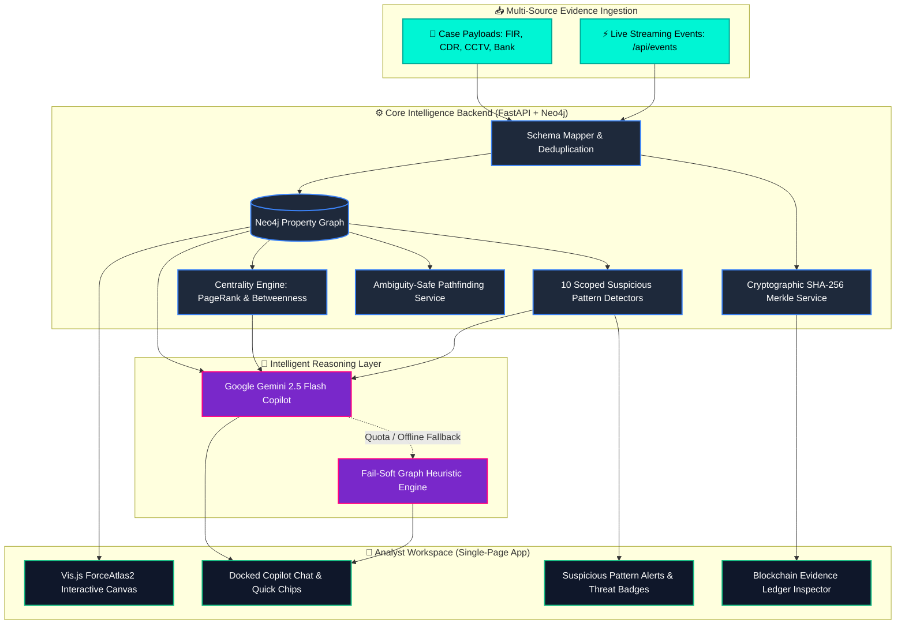

<div align="center">

<!-- Animated Dynamic Header Banner -->


<!-- Animated Dynamic Typing Effect -->
<p align="center">
  <a href="https://github.com/Thxrun-07/AI-Powered-Criminal-Network-Analysis-System">
    
  </a>
</p>

<!-- Live Badges Matrix -->
<p align="center">
  
  
  
  
  
  
</p>

---

<p align="center">
  <b>An enterprise-grade forensic intelligence ecosystem built for law enforcement, intelligence bureaus, and crime investigation agencies. Harmonizes disparate multi-jurisdiction records (FIRs, CDRs, CCTV ANPR, Banking Wires) into a unified property graph, detects 10 sophisticated criminal tradecraft patterns, and provides an integrated, resilient Gemini AI Graph Copilot.</b>
</p>

</div>

---

## 📑 Quick Navigation

| 🎨 [Frontend](frontend/README.md) | ⚙️ [Backend](backend/README.md) | 📂 [Dataset](dataset/README.md) | 🧪 [Tests](tests/README.md) | 🔒 [Blockchain](data/README.md) | 📑 [Documentation](docs/README.md) |
| :---: | :---: | :---: | :---: | :---: | :---: |
| Single Page App & Vis.js | FastAPI & Cypher Engine | Multi-Modal Evidence | 211 Passing Tests | SHA-256 Ledger | Specifications & Guides |

---

## 📌 The Problem & Strategic Solution

Modern criminal syndicates operate with distributed, compartmentalized tradecraft:
- Multiple burner SIM cards cycled across shared physical IMEI hardware.
- Multi-hop Hawala and nominee mule bank accounts structured to defeat AML thresholds.
- Cross-jurisdiction operational cells filing disconnected FIRs in different districts.
- Coordinated vehicle convoys and spatial-temporal co-presence during incident windows.

The **AI-Powered Criminal Network Analysis System** solves this through autonomous multi-modal graph fusion, continuous heuristic and LLM reasoning, and mathematically provable chain-of-custody tracking.

---

## 🏛️ System Architecture Pipeline



---

## 🤖 Gemini 2.5 Flash Graph Copilot

<div align="center">
  
</div>

The **Gemini AI Copilot** is docked directly into the interactive graph explorer (`#graphAiPanel`), enabling non-technical field investigators to interrogate complex graph topologies using natural language.

### 💬 Sample Live Copilot Interaction

```text
┌─ 🔍 INVESTIGATOR QUERY ─────────────────────────────────────────────────────────────┐
│ "Summarize the key suspects and explain how funds are being moved across cases."     │
└─────────────────────────────────────────────────────────────────────────────────────┘
                                   │
                                   ▼
┌─ 🤖 GEMINI 2.5 FLASH COPILOT RESPONSE ──────────────────────────────────────────────┐
│ ✦ PRIMARY SUSPECT IDENTIFIED: Vikram Singh (Central Kingpin)                        │
│   • Centrality: PageRank 0.084 (Rank #1) | Betweenness 0.421 (Syndicate Bridge)     │
│   • Cross-Case Overlap: Directly links CASE-2024-001 (Homicide) & CASE-2024-002    │
│                                                                                     │
│ ✦ FINANCIAL LAUNDERING TRAIL (Hawala Pattern Detected):                             │
│   • Account ACCT-001 (Vikram Singh) ──[₹500,000]──► ACCT-002 (Mule - Rahul Varma)  │
│   • ACCT-002 dispersed ₹250,000 each to ACCT-003 & ACCT-004 within 14 minutes.     │
│                                                                                     │
│ ✦ CO-LOCATION WARNING:                                                              │
│   • Phone +91-98765-43210 and +91-91234-56789 connected to Sector-4 Cell Tower     │
│     during the incident window (2024-08-15 22:45:00 UTC).                          │
└─────────────────────────────────────────────────────────────────────────────────────┘
```

### ⚡ One-Click Investigative Prompt Chips
- 🔍 **Summarize Key Suspects**: Extracts primary targets, aliases, and arrest records.
- 💸 **Find Laundering Rings**: Traces structured layering across nominee mule accounts.
- 🌐 **Explain Cross-Case Connections**: Identifies overlapping entities connecting disconnected FIRs.
- 👑 **Who is the Central Kingpin?**: Analyzes PageRank and bridge betweenness centrality.

---

## 🔑 Gemini API Key Configuration & Rotation Guide

The platform uses Google Gemini 2.5 Flash. You can obtain a free key and rotate it at any time with zero downtime.

### Step 1: Obtain a Free Key
1. Visit the **[Google AI Studio](https://aistudio.google.com/app/apikey)**.
2. Sign in with any Google account.
3. Click **"Create API Key"** and copy your token.

### Step 2: Configure in `.env`
Edit or create your `.env` file at the root of the project:
```ini
# .env
GEMINI_API_KEY=AIzaSyYourGeneratedGeminiKeyHere
GEMINI_MODEL=gemini-2.5-flash
```

### Step 3: Restart Backend
```powershell
uvicorn backend.main:app --reload
```

---

### 🛡️ Zero-Downtime Heuristic Fallback Guarantee
> [!IMPORTANT]
> **What happens if your free Gemini credit runs out or Google returns HTTP 429 Quota Exceeded?**
>
> The system includes a **hardened, autonomous fail-soft architecture** (`backend/services/gemini_service.py`):
> 1. If the API key is missing, expired, or rate-limited, the system **never crashes, never fails, and shows zero error dialogs**.
> 2. It immediately shifts to an internal **Deterministic Graph Heuristics Engine**:
>    - Dynamically evaluates node degree centrality, PageRank, and betweenness scores.
>    - Scans active pattern detections (Hawala, SIM swaps, co-locations).
>    - Generates a structured, evidence-backed investigative briefing directly in the chat panel.
> 3. Once a new valid key is provided in `.env`, the system automatically resumes utilizing Gemini 2.5 Flash!

---

## 🕵️ The 10 Automated Suspicious Pattern Detectors

Every detector runs case-scoped Cypher queries optimized for high throughput:

| # | Detector Name | Threat Level | Algorithmic Mechanism |
| :-: | :--- | :-: | :--- |
| **1** | **Frequent Caller Spikes** |  | Detects communication volume outliers (>30 calls) between unassociated nodes in short intervals. |
| **2** | **Burner SIM / IMEI Multi-Swap** |  | Traces multiple phone numbers registered to or transmitting through identical physical IMEI hardware. |
| **3** | **Hawala & Laundering Rings** |  | Detects rapid-succession funds transfers traversing 3+ intermediary accounts to obscure origin. |
| **4** | **Mule Account Syndicates** |  | Flags historically dormant accounts suddenly receiving high-velocity, high-sum deposits. |
| **5** | **Cross-Case Suspect Overlap** |  | Pinpoints identical person nodes, vehicles, or bank accounts present across separate FIRs. |
| **6** | **Vehicle Convoy Tracking** |  | Identifies pairs or groups of vehicles logged at identical CCTV ANPR cameras within 5-minute margins. |
| **7** | **Crime Scene Co-Location** |  | Matches cell tower sector connections of multiple suspects within the temporal window of an FIR. |
| **8** | **Meeting & Association Clusters** |  | Calculates network clique density to discover co-accused meeting clusters. |
| **9** | **Shell Company / Dummy Address Rings** |  | Detects multiple commercial legal entities registered to identical physical postal addresses. |
| **10** | **Centrality Kingpin Leaderboard** |  | Executes PageRank & Betweenness Centrality to isolate network commanders vs. logistics mules. |

---

## 🔒 Cryptographic Chain of Custody (Blockchain Ledger)

In compliance with forensic digital evidence admissibility standards (e.g., Section 65B of the Indian Evidence Act / BSA provisions), every piece of ingested data is permanently anchored in a local cryptographic blockchain.

```json
{
  "index": 1,
  "timestamp": "2026-09-04T12:00:00Z",
  "case_id": "CASE-2024-001",
  "previous_hash": "0000000000000000000000000000000000000000000000000000000000000000",
  "merkle_root": "7f83b1657ff1fc53b92dc18148a1d65dfc2d4b1fa3d677284addd200126d9069",
  "data_summary": { "entity_count": 42, "relationship_count": 87 },
  "block_hash": "b5a2c3d4..."
}
```

- **Deterministic Merkle Trees**: All nodes and edges are normalized and hashed with SHA-256.
- **Unbroken Cryptographic Hash Chaining**: Every block contains the `previous_hash` of its predecessor.
- **Tamper Verification API**: Call `GET /api/blockchain/verify` to validate ledger integrity anytime.

---

## 🚀 Quickstart & Installation

### Option 1: One-Click Docker Setup (Recommended)
Spins up Neo4j 5.x and the FastAPI application with all APOC graph procedures pre-installed:

```powershell
# 1. Clone the repository
git clone https://github.com/Thxrun-07/AI-Powered-Criminal-Network-Analysis-System.git
cd AI-Powered-Criminal-Network-Analysis-System

# 2. Configure environment
copy .env.example .env

# 3. Start containers
docker-compose up -d
```
Open **[http://localhost:8000](http://localhost:8000)** in your browser!

---

### Option 2: Native Local Setup

```powershell
# 1. Clone & enter repository
git clone https://github.com/Thxrun-07/AI-Powered-Criminal-Network-Analysis-System.git
cd AI-Powered-Criminal-Network-Analysis-System

# 2. Create virtual environment
python -m venv venv
.\venv\Scripts\Activate.ps1

# 3. Install dependencies
pip install -r requirements.txt

# 4. Configure environment
copy .env.example .env

# 5. Launch application
uvicorn backend.main:app --host 0.0.0.0 --port 8000 --reload
```

---

## 🧪 Comprehensive Verification Suite

Run all 211 unit and integration tests completely offline without requiring an external database:

```powershell
pytest tests/unit tests/integration
```

```text
============================= test session starts =============================
platform win32 -- Python 3.14.0, pytest-9.1.1
rootdir: C:\Users\shinc\projects\AI-Powered-Criminal-Network-Analysis-System
collected 211 items

tests\unit\test_ai_insights.py .....                                     [  2%]
tests\unit\test_batched_relationship_writers.py .....................    [ 12%]
tests\unit\test_blockchain_ledger.py ....                                [ 14%]
tests\unit\test_case_delete.py ......                                    [ 17%]
tests\unit\test_delta_processor.py ................                      [ 24%]
tests\unit\test_entity_search.py .....                                   [ 27%]
tests\unit\test_event_model.py ...............                           [ 34%]
tests\unit\test_insights_10_types.py ..........                          [ 38%]
tests\unit\test_logging_masking.py ...                                   [ 40%]
tests\unit\test_rankings.py ....                                         [ 42%]
tests\unit\test_scoped_detectors.py .................................... [ 59%]
......................                                                   [ 69%]
tests\unit\test_shortest_path.py ......                                  [ 72%]
tests\integration\test_events_api.py .........................           [ 84%]
tests\integration\test_health_and_reset.py ....                          [ 86%]
tests\integration\test_ingest_merge.py ....                              [ 88%]
tests\integration\test_ingest_ordering.py ......                         [ 90%]
tests\integration\test_ingest_replace.py ..                              [ 91%]
tests\integration\test_legacy_ingest_casedata.py ................        [ 99%]
tests\integration\test_unified_ingest.py .                               [100%]

====================== 211 passed in 3.01s =======================
```

---

## 📂 Repository File Structure

```
AI-Powered-Criminal-Network-Analysis-System/
├── README.md                           # ⭐ Main Showcase & System Overview
├── .env.example                        # Safe environment template
├── .gitignore                          # Strict security exclusion for secrets & caches
├── docker-compose.yml                  # Neo4j + Backend container orchestration
├── Dockerfile                          # Multi-stage production container build
├── pytest.ini                          # Pytest configuration
├── requirements.txt                    # Pinned production dependencies
│
├── frontend/                           # 🎨 Modern Single-Page Analyst Application
│   ├── index.html                      # Interactive Vis.js network canvas & Copilot UI
│   └── README.md                       # 👉 Detailed Frontend Guide
│
├── backend/                            # ⚙️ FastAPI Graph Intelligence Engine
│   ├── main.py                         # Application entrypoint & static routes
│   ├── database.py                     # Neo4j driver connection pool
│   ├── config.py                       # Settings & environment validation
│   ├── logging_config.py               # Structured logging with PII masking
│   ├── models/                         # Pydantic v2 schemas (Entities, Events, Insights)
│   ├── routers/                        # REST API endpoint controllers
│   ├── services/                       # Graph writers, Detectors, Blockchain & AI
│   └── README.md                       # 👉 Detailed Backend Architecture Guide
│
├── dataset/                            # 📂 Forensic Case Evidence Payloads
│   ├── case_001_homicide.json          # Multi-source homicide case (FIR, CDR, CCTV)
│   ├── case_002_fraud.json             # Corporate fraud with cross-case overlap
│   ├── envelope_sample.json            # Real-time streaming event envelope
│   └── README.md                       # 👉 Forensic Dataset & Ingestion Guide
│
├── tests/                              # 🧪 Automated Test Suite (211+ Passing Tests)
│   ├── unit/                           # Isolated unit tests
│   ├── integration/                    # API & pipeline integration tests
│   ├── live/                           # Live Neo4j equivalence tests
│   ├── conftest.py                     # Mock fixtures & blockchain test isolation
│   └── README.md                       # 👉 Testing Suite Guide & Commands
│
├── data/                               # 🔒 Cryptographic Blockchain Ledger
│   ├── blockchain_ledger.json          # Verifiable chain-of-custody blocks
│   └── README.md                       # 👉 Blockchain & Tamper-Proofing Guide
│
└── docs/                               # 📑 Technical Specifications & Runbooks
    ├── EVENTS_API.md                   # Real-time event streaming specification
    ├── SUMMARY.md                      # Comprehensive system architecture & entity model
    ├── SYSTEM_ARCHITECTURE_AND_OPERATIONS_GUIDE.md # Production runbook & failover guide
    └── README.md                       # 👉 Documentation Index & Roadmap
```

---

## 🔗 Key API Endpoints Reference

| Method | Endpoint | Description |
| :--- | :--- | :--- |
| `GET` | `/` | Serves Analyst Dashboard Single Page App |
| `POST` | `/api/graph/ai-query` | Dispatches natural language queries to Gemini Copilot |
| `GET` | `/api/graph/data` | Fetches filtered nodes & relationships for Vis.js canvas |
| `POST` | `/api/cases/ingest` | Ingests multi-source forensic case payloads |
| `POST` | `/api/events` | Streams real-time operational delta events |
| `GET` | `/api/insights` | Executes 10 automated suspicious pattern detectors |
| `GET` | `/api/rankings` | Computes PageRank and centrality rankings |
| `GET` | `/api/path/shortest` | Computes shortest path with ambiguity candidate resolution |
| `GET` | `/api/blockchain/verify` | Validates cryptographic chain of custody |
| `GET` | `/health` | Application health and database connectivity probe |

Interactive documentation is available at **`/docs`** (Swagger UI) and **`/redoc`** (ReDoc).

---

<div align="center">

<!-- Animated Waving Gradient Footer -->


<p align="center">
  <b>Built for the Smart India Hackathon (SIH) &bull; National Law Enforcement Innovation</b><br/>
  <i>Empowering investigators with Graph AI, Cryptographic Integrity, and Autonomous Reasoning.</i>
</p>

</div>
