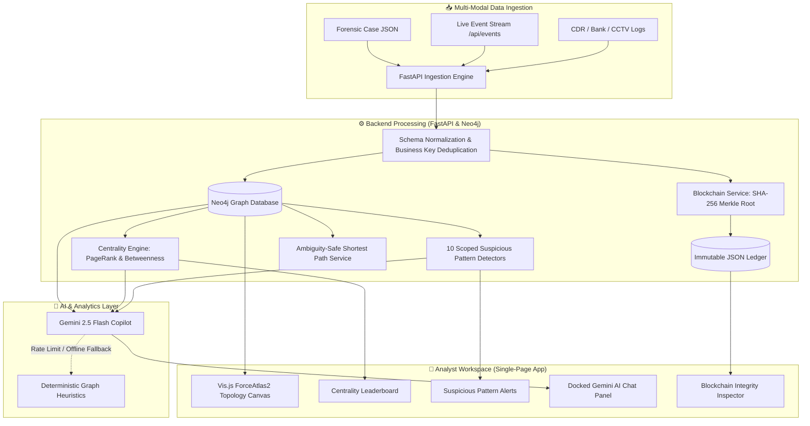

<div align="center">

# 🕸️ AI-Powered Criminal Network Analysis System
### Autonomous Forensic Graph Intelligence, Multi-Jurisdiction Link Discovery & Chain-of-Custody Platform

[](https://www.python.org/)
[](https://fastapi.tiangolo.com/)
[](https://neo4j.com/)
[](https://ai.google.dev/)
[](tests/)
[](#-cryptographic-chain-of-custody-blockchain-ledger)

<p align="center">
  <b>A state-of-the-art forensic intelligence platform designed for law enforcement and investigative agencies to ingest disparate criminal data, resolve multi-case syndicates, execute 10 automated pattern detectors, and query graph topologies using an integrated Gemini AI Copilot.</b>
</p>

</div>

---

## 📌 Executive Summary

Modern criminal syndicates operate across jurisdictional boundaries, leveraging burner phones, mule bank accounts, corporate shell structures, and layered communications to conceal illicit networks. Traditional relational databases fail to capture these multi-hop relationships.

The **AI-Powered Criminal Network Analysis System** solves this by uniting:
1. **Multi-Source Graph Ingestion**: Automatically harmonizes FIRs, Call Detail Records (CDR), Bank Transactions, CCTV vehicle sightings, and arrest reports into a unified Neo4j property graph.
2. **10 Automated Suspicious Pattern Detectors**: Scoped Cypher algorithms detecting Hawala laundering, SIM card swaps, mule rings, meeting clusters, and vehicle convoys.
3. **Gemini 2.5 Flash Graph Copilot**: A conversational AI analyst directly inside the graph visualization canvas providing instant natural language insights, with **automatic zero-downtime offline heuristic fallback**.
4. **Cryptographic Chain of Custody**: An immutable SHA-256 Merkle tree evidence ledger guaranteeing legal admissibility and tamper detection (Section 65B compliant).

---

## 🏛️ System Architecture



---

## ✨ Core Features & Highlights

### 1. 🤖 Gemini 2.5 Flash Graph Copilot
- Docked seamlessly into the interactive graph canvas (`#graphAiPanel`).
- Translates natural language inquiries into actionable investigative insights.
- **Quick-Prompt Chips**:
  - *"Summarize Key Suspects"*
  - *"Find Financial Laundering Rings"*
  - *"Explain Cross-Case Connections"*
  - *"Who is the Central Kingpin?"*
- **Built-in Resilience**: If credits expire, quota is exceeded, or the network is offline, the backend seamlessly switches to deterministic graph topology heuristic analysis with **zero downtime**.

### 2. 🕵️ 10 Automated Suspicious Pattern Detectors
High-performance Cypher detectors engineered to identify illicit tradecraft:
- **Frequent Caller Rings**: Anomalous communication frequency bursts.
- **Burner SIM / IMEI Multi-Swap**: Multiple phone numbers tied to shared physical hardware.
- **Hawala & Money Laundering Rings**: Rapid layer-and-integrate fund transfers.
- **Mule Account Syndicates**: Sudden large-scale deposits into dormant bank accounts.
- **Cross-Case Suspect Overlap**: Individuals appearing in unrelated multi-jurisdictional FIRs.
- **Vehicle Convoy Movement**: Multiple vehicles traveling identical temporal-spatial routes.
- **Crime Scene Co-Location**: Suspects pinging identical cell tower sectors during incident windows.
- **Meeting & Association Clusters**: Dense cliques of co-accused individuals.
- **Shell Company / Shared Address Rings**: Organizations sharing dummy physical addresses.
- **Centrality Kingpin Ranking**: PageRank, Betweenness, and Degree centrality scoring.

### 3. 🔒 Cryptographic Chain-of-Custody (Blockchain)
- Generates a cryptographically linked block for every ingested case payload.
- Calculates an unbroken SHA-256 Merkle Tree over all entities and relations.
- Exposes `GET /api/blockchain/verify` to instantly validate evidence integrity.

---

## 🔑 Gemini AI API Key Setup & Rotation Guide

The system uses **Google Gemini 2.5 Flash** to power the Graph Copilot. You can easily obtain a free API key or rotate keys when free credits/quotas expire.

### How to Get a Free API Key
1. Visit **[Google AI Studio](https://aistudio.google.com/app/apikey)**.
2. Sign in with your Google account.
3. Click **"Create API Key"** and copy the generated key.

### How to Configure or Update the API Key
Open your `.env` file in the project root:
```ini
# .env
GEMINI_API_KEY=your_new_gemini_api_key_here
GEMINI_MODEL=gemini-2.5-flash
```

Restart or start the backend:
```powershell
uvicorn backend.main:app --reload
```

### 🛡️ Zero-Downtime Guarantee (Credit Expiry & Offline Protection)
> [!TIP]
> **What happens if your free API credit expires or Google returns HTTP 429 Quota Exceeded?**
>
> The system is architected with a **fail-soft heuristic fallback** (`backend/services/gemini_service.py`):
> - If the API key is missing, invalid, or hits quota limits, the backend automatically performs deep topological analysis locally using graph centrality and suspicious pattern metrics.
> - The analyst receives rich, structured criminal intelligence immediately without any error popups or system interruptions.
> - Once you enter a new valid key into `.env`, the system resumes using Gemini 2.5 Flash automatically!

---

## 🚀 Quickstart Guide

### Prerequisites
- Python 3.11+
- Neo4j 5.x LTS (Local instance or Docker)

### Option 1: Quickstart with Docker Compose (Recommended)
Spins up both Neo4j and the FastAPI backend with all plugins pre-configured:

```powershell
# 1. Clone the repository
git clone https://github.com/<username>/AI-Powered-Criminal-Network-Analysis-System.git
cd AI-Powered-Criminal-Network-Analysis-System

# 2. Configure environment
copy .env.example .env

# 3. Start services
docker-compose up -d
```

Access the Analyst Dashboard at: **[http://localhost:8000](http://localhost:8000)**

---

### Option 2: Local Native Setup

```powershell
# 1. Clone & enter repository
git clone https://github.com/<username>/AI-Powered-Criminal-Network-Analysis-System.git
cd AI-Powered-Criminal-Network-Analysis-System

# 2. Create and activate virtual environment
python -m venv venv
.\venv\Scripts\Activate.ps1

# 3. Install dependencies
pip install -r requirements.txt

# 4. Configure .env
copy .env.example .env
# Edit .env with your Neo4j credentials and Gemini API Key

# 5. Launch backend server
uvicorn backend.main:app --host 0.0.0.0 --port 8000 --reload
```

---

## 📂 Project Directory Structure

```
AI-Powered-Criminal-Network-Analysis-System/
├── README.md                           # ⭐ Main Platform Overview (This document)
├── .env.example                        # Template environment configuration
├── .gitignore                          # Strict protection for secrets & caches
├── docker-compose.yml                  # Neo4j + Backend container orchestration
├── Dockerfile                          # Multi-stage production container build
├── pytest.ini                          # Test runner configuration
├── requirements.txt                    # Pinned production dependencies
│
├── frontend/                           # 🎨 Modern Single-Page Analyst Application
│   ├── index.html                      # Interactive Vis.js network canvas & Copilot UI
│   └── README.md                       # 👉 Detailed Frontend Guide
│
├── backend/                            # ⚙️ FastAPI Graph Intelligence & Core Engine
│   ├── main.py                         # Application entrypoint & static routes
│   ├── database.py                     # Neo4j driver connection pool
│   ├── config.py                       # Environment settings
│   ├── logging_config.py               # Structured logging with PII masking
│   ├── models/                         # Pydantic data schemas (Entities, Events, Insights)
│   ├── routers/                        # REST API controllers
│   ├── services/                       # Graph writers, Detectors, Blockchain & AI
│   └── README.md                       # 👉 Detailed Backend Architecture Guide
│
├── dataset/                            # 📂 Forensic Case Evidence Payloads
│   ├── case_001_homicide.json          # Multi-source homicide case (FIR, CDR, CCTV)
│   ├── case_002_fraud.json             # Corporate fraud with cross-case overlap
│   ├── envelope_sample.json            # Real-time streaming event envelope
│   └── README.md                       # 👉 Forensic Dataset & Ingestion Guide
│
├── tests/                              # 🧪 Automated Test Suite (211+ Passing Tests)
│   ├── unit/                           # Isolated unit tests
│   ├── integration/                    # API & pipeline integration tests
│   ├── live/                           # Live Neo4j equivalence tests
│   ├── conftest.py                     # Mock fixtures & blockchain test isolation
│   └── README.md                       # 👉 Testing Suite Guide & Commands
│
├── data/                               # 🔒 Cryptographic Blockchain Ledger
│   ├── blockchain_ledger.json          # Verifiable chain-of-custody blocks
│   └── README.md                       # 👉 Blockchain & Tamper-Proofing Guide
│
└── docs/                               # 📑 Technical Specifications & Runbooks
    ├── EVENTS_API.md                   # Real-time event streaming specification
    ├── SUMMARY.md                      # Comprehensive system architecture & entity model
    ├── SYSTEM_ARCHITECTURE_AND_OPERATIONS_GUIDE.md # Production runbook & failover guide
    └── README.md                       # 👉 Documentation Index & Roadmap
```

---

## 🧪 Testing & Verification

Run the comprehensive test suite (211 unit and integration tests) completely offline:

```powershell
pytest tests/unit tests/integration
```

**Results**:
```text
============================= test session starts =============================
platform win32 -- Python 3.14.0, pytest-9.1.1
rootdir: C:\Users\shinc\projects\AI-Powered-Criminal-Network-Analysis-System
collected 211 items

tests\unit\test_ai_insights.py .....                                     [  2%]
tests\unit\test_batched_relationship_writers.py .....................    [ 12%]
tests\unit\test_blockchain_ledger.py ....                                [ 14%]
tests\unit\test_case_delete.py ......                                    [ 17%]
tests\unit\test_delta_processor.py ................                      [ 24%]
tests\unit\test_entity_search.py .....                                   [ 27%]
tests\unit\test_event_model.py ...............                           [ 34%]
tests\unit\test_insights_10_types.py ..........                          [ 38%]
tests\unit\test_logging_masking.py ...                                   [ 40%]
tests\unit\test_rankings.py ....                                         [ 42%]
tests\unit\test_scoped_detectors.py .................................... [ 59%]
......................                                                   [ 69%]
tests\unit\test_shortest_path.py ......                                  [ 72%]
tests\integration\test_events_api.py .........................           [ 84%]
tests\integration\test_health_and_reset.py ....                          [ 86%]
tests\integration\test_ingest_merge.py ....                              [ 88%]
tests\integration\test_ingest_ordering.py ......                         [ 90%]
tests\integration\test_ingest_replace.py ..                              [ 91%]
tests\integration\test_legacy_ingest_casedata.py ................        [ 99%]
tests\integration\test_unified_ingest.py .                               [100%]

====================== 211 passed, 36 warnings in 3.00s =======================
```

---

## 🔗 REST API Endpoints Overview

| Method | Endpoint | Description |
| :--- | :--- | :--- |
| `GET` | `/` | Serves Analyst Dashboard Single Page App |
| `POST` | `/api/graph/ai-query` | Dispatches natural language queries to Gemini Copilot |
| `GET` | `/api/graph/data` | Fetches filtered nodes & relationships for graph visualization |
| `POST` | `/api/cases/ingest` | Ingests multi-source forensic case payloads |
| `POST` | `/api/events` | Ingests real-time streaming operational events |
| `GET` | `/api/insights` | Executes 10 automated suspicious pattern detectors |
| `GET` | `/api/rankings` | Computes PageRank and centrality rankings |
| `GET` | `/api/path/shortest` | Computes shortest path with ambiguity candidate resolution |
| `GET` | `/api/blockchain/verify` | Validates cryptographic chain of custody |
| `GET` | `/health` | Application health and database connectivity probe |

Interactive documentation is available at `/docs` (Swagger UI) and `/redoc` (ReDoc).

---

## 📜 License
Developed for the Smart India Hackathon (SIH) under the Problem Statement for Law Enforcement Intelligence Systems.
